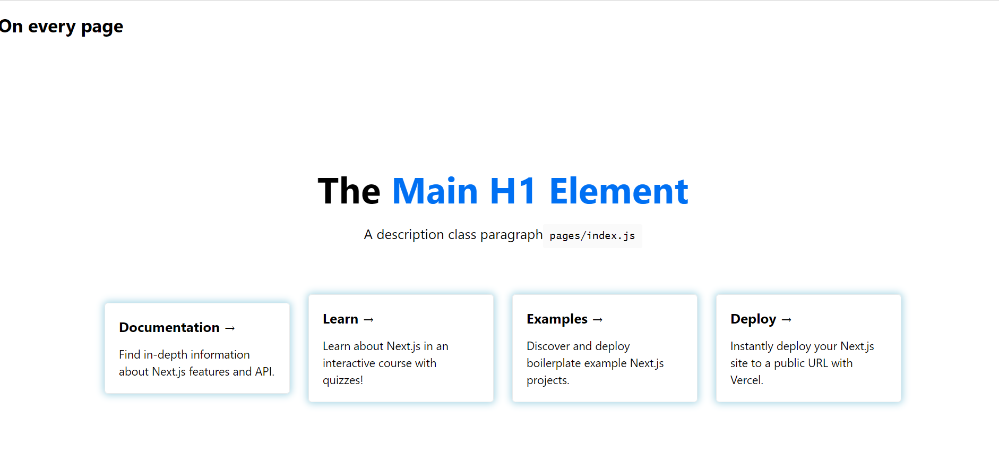

This is a starter template for [Learn Next.js](https://nextjs.org/learn).

**How to Use this example...**
- Open Visual Studio Code
- Create a folder for this clone, then open Terminal/New Terminal
- git clone https://github.com/Javaman2/Nextjs.git
- Change to the newly created directory
- Type in npm install and then npm run dev
- You should see this:



**Notes**

We like Next.js because it has built in routing! Any new function component found in the pages folder is automatically found in the url
using that name e.g. https://localhost:3000/time

Take a look at the time.js file.

Site Templating is simple just put in an _app.js file in the pages folder. Like this:

```html
import "../styles/globals.css";
export default function MyApp({ Component, pageProps }) {
  return(
  <div>
    <h1>On every page</h1>
    <Component {...pageProps} />
  </div>
  );
}
```
This function takes in a react {Component, pageProps} object, which is auto injected. And it returns that Component and ...pageProps but with the added HTML.  This works for every page, meaning you can put in headers, menus, and footers on this page. 

If you have any issues, please log them!

Regards;
JP
